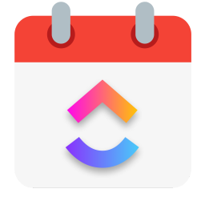
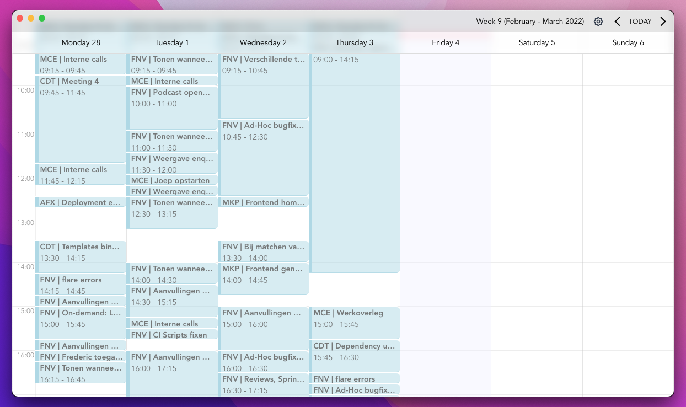

A tool for tracking time on Clickup tasks

Easily drag & resize events around on a calendar. Changes are synced with ClickUp in real time!

You can download the latest release for your platform of choice from the [releases page](https://github.com/gwleuverink/clickup-time-tracker/releases)

If you'd like to contribute please check out the getting started doc [over here](./docs/development.md)

**Disclaimer:** This project is fully functional but still has some quirks & is not quite feature-complete just yet. Feedback and contributions are highly appreciated.

## Roadmap

- [x] Fetch & list tracking entries for active view
- [x] Create a new entry by dragging on the calendar
- [x] Search through all Clickup tasks in searchable select field when adding a new entry
- [x] Refresh cached Clickup tasks asynchronously in the background process with convenient UI control
- [x] Update a time entry when resizing/moving the event
- [x] Disable editing (resize/drag/delete) when the associated task is closed
- [x] Add proper accesibility support & hooks to create & detail modals
- [x] Double click event to show details
- [x] In details modal add a button to delete the tracking entry
- [x] Add select + backspace to delete support
- [x] Add copy/paste support
- [x] Show proper toast alerts when things happen in the app
- [x] Add full bleed title bar
- [x] Add a preferences screen where the user can set env variables
- [x] Add online/offline state splash screen
- [x] Replace all inline svg's with svg components (heroicons included in project)
- [x] Add proper validation to create modal
- [x] Rewrite css overrides to scss
- [x] Auto updater using Github registry
- [x] Add animated loading splash screen
- [x] Add optional background image
- [x] Show error message (and log) when fetching task list from background process fails
- [x] Customize app menu
- [ ] Refactor to composition API

### Milestones
- [ ] Extract edit & create modals to separate components (consider this)
- [ ] Optional settings for modifing start & end of day
- [ ] Setting for toggling weekends
- [ ] Add JSON Schema for setting store with default values for start/end of day & weekend toggle
- [ ] Add caching with TTL on fetched task list
- [ ] In details modal make an option to update tracking description/attached task
### Quick wins
- [ ] Button to refresh current view (and tracked entries in that view)
- [ ] Sort selectable tasks by latest log entry (might not be possible since tracked time is not added to tasks fetch payload)
- [ ] After that sort selectable tasks by updated_at date
- [ ] Reset a task when an API error occured while editing (resize/drag etc)
- [ ] Filter Tasks API call to exclude Tasks with status 'Requested, Backlog, Closed' etc
- [ ] Add error reporting (sentry)
